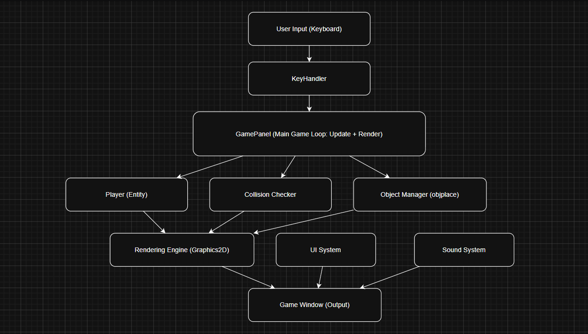
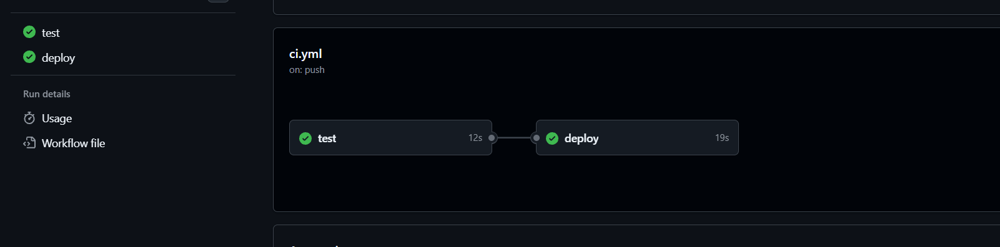
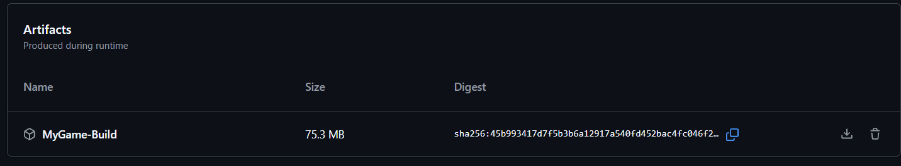

## 1. Project Title

2D JAVA GAME

---

## 3. Architecture Diagram

---

## 4. CI/CD Pipeline Explanation

The project uses GitHub Actions to implement a CI/CD pipeline.

On every push or pull request, the pipeline runs automated tests using JUnit to ensure code correctness. The test job compiles the Java code and executes all test cases.

If the tests pass and the code is pushed to the main branch, the deployment job is triggered. This job compiles the main application, packages it into a JAR file, and uploads it as an artifact.

This ensures that only tested and verified code is built and distributed.

---

## 5. Git Workflow Used

###  Branching Strategy

The project follows a simple branching strategy using:

* `main` → stable production-ready code
* `feature/*` → used for developing new features or changes

All new work is done on feature branches and later merged into the main branch.

---

###  Pull Requests

Pull Requests are used to merge feature branches into the main branch.
This ensures that all changes are reviewed and tested before being added to the main codebase.

---

###  Code Reviews

Before merging, changes are reviewed through Pull Requests.
This helps identify bugs, improve code quality, and ensure consistency in the project.

---

###  Merge Strategy

The project primarily uses the **merge strategy**:

* Feature branches are merged into `main` after testing
* GitHub Actions ensures tests pass before merging
* In some cases, squash merging can be used to keep commit history clean

---

---

## 6. Tools Used

All tools and technologies:

* Language: JAVA
* CI/CD: GitHub Actions

---

## 7. Screenshots

### ✅ Pipeline Success

### 🚀 Deployment Output

---

## 8. Challenges Faced

###  Challenge 1: Setting up JUnit without build tools

Since the project does not use Maven or Gradle, integrating JUnit for testing was difficult. Dependencies had to be managed manually.

**Solution:**
Downloaded the JUnit standalone JAR file and configured the classpath manually during compilation and execution.

---

###  Challenge 2: Writing CI pipeline without build tools

Automating the build and test process in GitHub Actions was challenging because there was no predefined build system.

**Solution:**
Used shell commands (`find`, `javac`, `java`) in the workflow to compile and run tests manually.

---

### Challenge 3: Handling classpath issues

During compilation and test execution, classpath errors occurred, especially when linking JUnit with project files.

**Solution:**
Explicitly defined the classpath including the JUnit JAR file during compilation and execution.

---

## 👤 Author

Your Name
GitHub: https://github.com/Tanuj524
